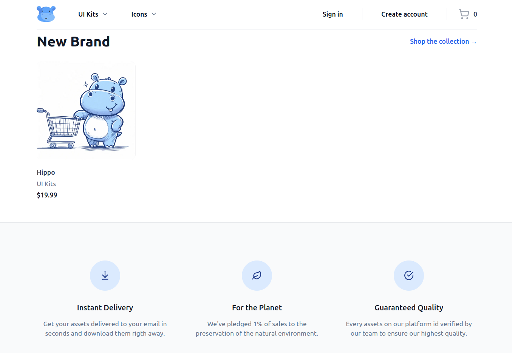
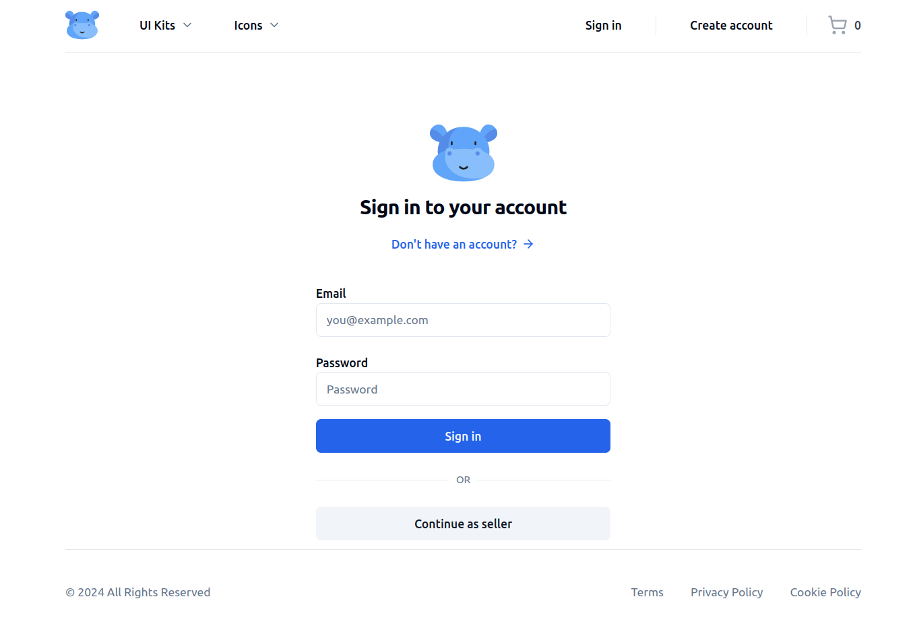
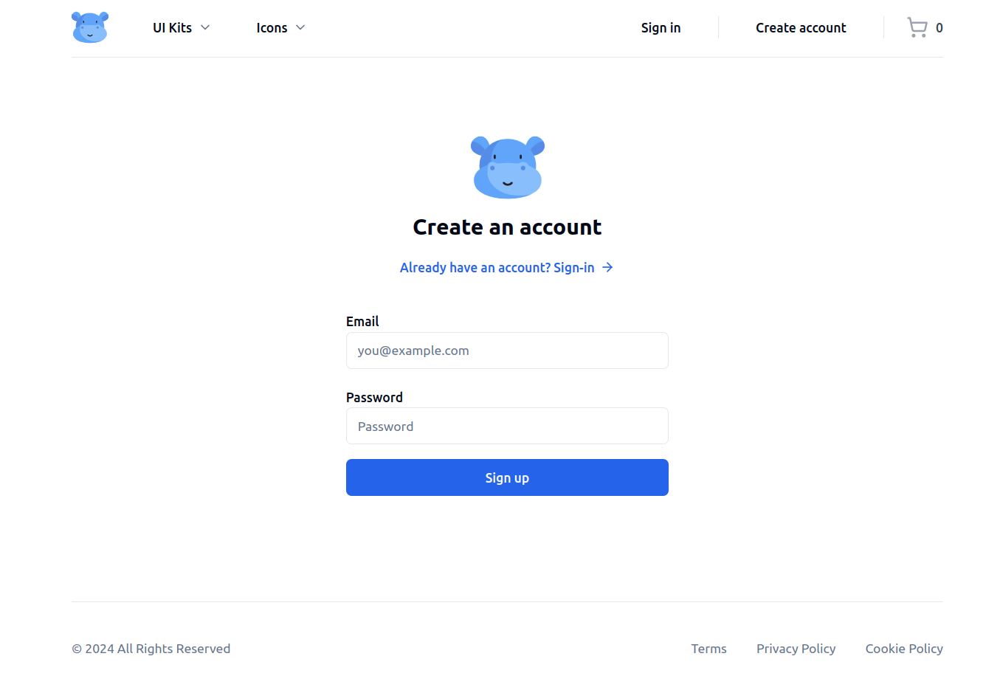
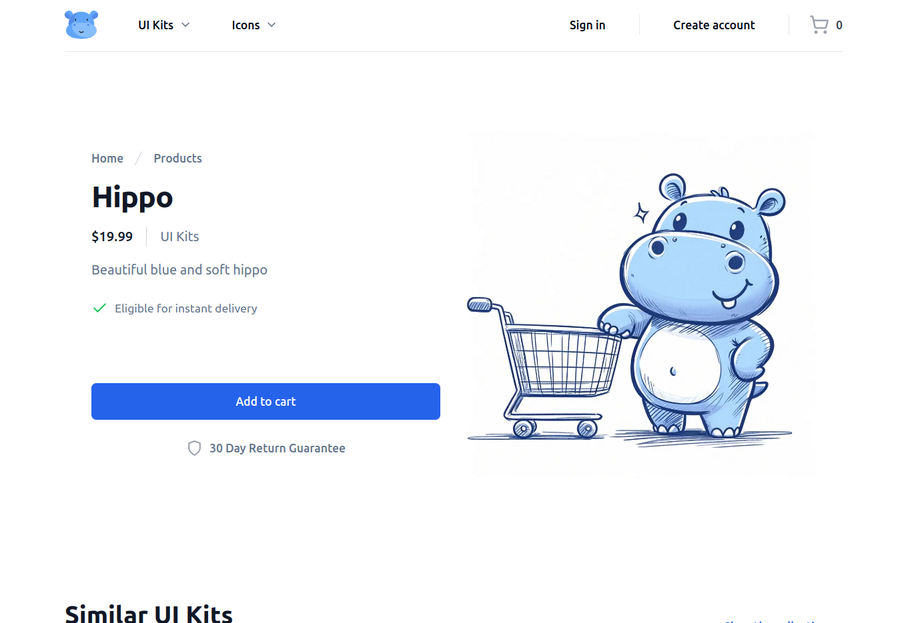
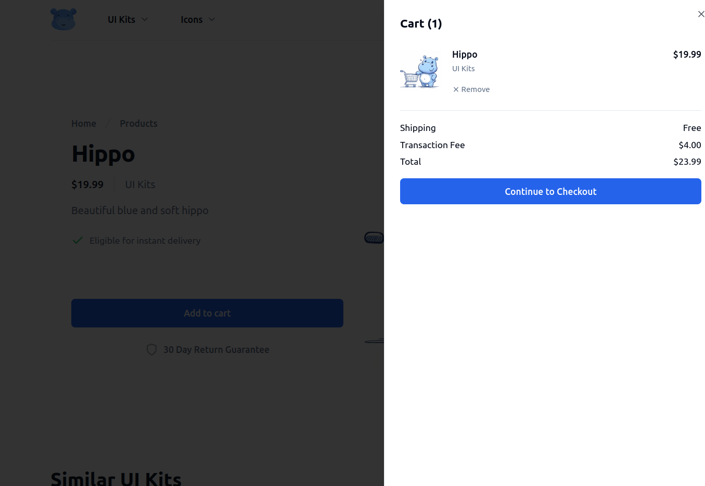
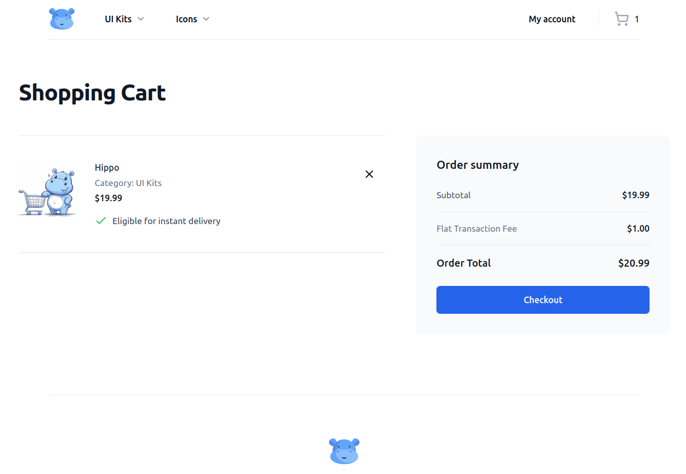
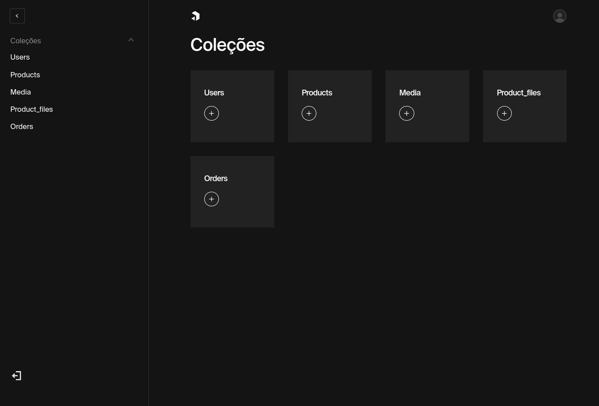
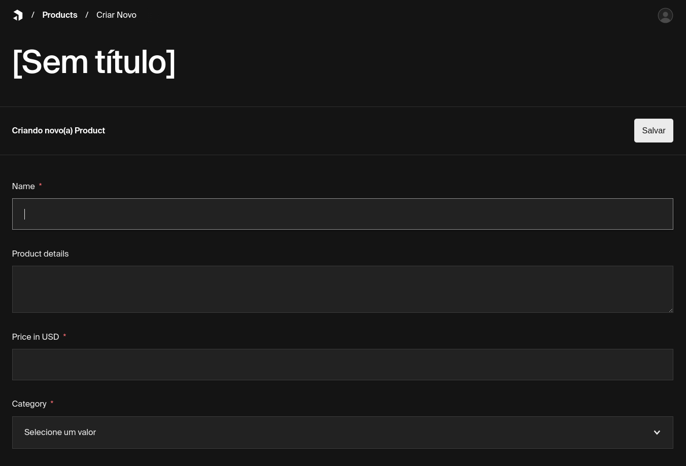

# - Fullstack E-Commerce Marketplace.

Desenvolvido com Next.js 14 App Router, tRPC, TypeScript, Payload & Tailwind

## Features

- 🛠️ Marketplace completo construído com Next.js 14
- 💻 Incrível landing Page, listagem de produtos e detalhes de um produto.
- 💳 Dashboard completo para o admin.
- 🛒 Persistências de produtos no carrinho de compras
- 🔑 Autenticação usando Payload
- 🌟 Moderna UI usando shadcn-ui.
- ✉️ Verificação por email para cadastro de conta.
- ✅ Admins podem verificar os produtos para serem listados.
- ⌨️ 100% esctito com TypeScript

## Apresentação

### Landing Page

### Login e cadastro de usuários

### Detalhes de um produto

### Carrinho e Checkout

---

### Payload CMS 

